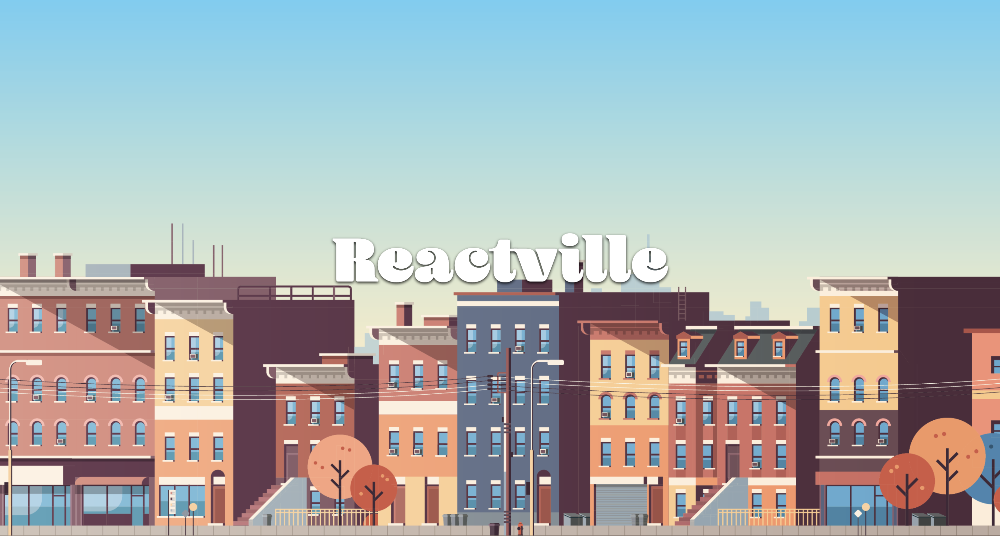

# 

## About

Welcome to Reactville, a constantly evolving virtual metropolis. Let's build this digital town together, one component at a time.

## About

Reactville Weather Station is at the heart of the town, keeping everyone informed about the ever-changing weather. They're in need of a tech upgrade and have called on you to develop their new 5-Day Weather Forecast App.

In this lab, you will create a user-friendly React application that displays a 5-day weather forecast. Your challenge is to implement a dynamic, component-based structure where you will practice the core concept of passing data using props in React.

## Prerequisites

- React Components

## Time to complete

Estimated time to complete core lab exercise: **60 min**

## Content

- [Setup](./setup/README.md)
- [Exercise](./exercise/README.md)

## Solution code

🏁 [Solution code](https://git.generalassemb.ly/modular-curriculum-all-courses/react-components-lab-solution)

## Internal resources

✏️ [Instructor Guide](./internal-resources/instructor-guide.md)

🏗️ [Release Notes](./internal-resources/release-notes.md)

---

**Find a 👾 bug 👾 or have suggestions? [Let us know](https://git.generalassemb.ly/modular-curriculum-all-courses/universal-resources-internal/blob/main/module-feedback.md)!**
